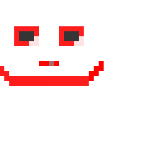

  <!-- Centered Main Title with Typewriter Effect -->
  <h1>
    
  </h1>
  
  <!-- Avatar -->
  

## <h2 align="center" style="color: #007ACC; text-shadow: 2px 2px 0px #C1C1C1;">🚀 About Me</h2>

📖 I'm an student of <strong>Computer Engineering</strong> student at the <strong>University of Isfahan</strong>. 
💻 Specializing in <strong>Backend Architecture</strong>, REST APIs, and integrating local LLMs (RAG pipelines). 
🏗️ Currently focused exclusively on building smart, scalable institutional software. 
☕ Fueled by dialled-in espresso shots. 
🎧 Usually walking while listening to podcasts or indie music.

## <h2 align="center" style="color: #007ACC; text-shadow: 2px 2px 0px #C1C1C1;">🛠️ Tech Stack</h2>

  
<strong>Languages</strong>

  
  
  
  
  
  
  
<strong>Backend & Databases</strong>

  
  
  
  

  
<strong>AI & Integrations</strong>

  
  
  
  
  
<strong>Frontend</strong>

  

## <h2 align="center" style="color: #007ACC; text-shadow: 2px 2px 0px #C1C1C1;">⚡ Currently Working On</h2>

Developing AI integrated systems and platforms and games. Or any other thing possible to do with a computer. 

## <h2 align="center" style="color: #007ACC; text-shadow: 2px 2px 0px #C1C1C1;">🌐 Connect With Me</h2>

  
  
  
  

 

<i>"How you doin'?"</i> ☕

